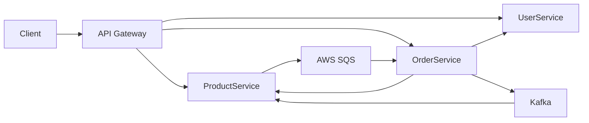

# Microservices Project

## Demo Video

The project demonstration video is available at:

- Demo: https: https://youtu.be/Q5ywP9bDNYg

---


## Overview

This project implements a cloud-native microservices architecture deployed on AWS.

The system simulates a small e-commerce backend and consists of four main services:

- API Gateway
- User Service
- Product Service
- Order Service

The project demonstrates:

- Microservices architecture
- REST communication
- Event-driven communication
- Docker containerization
- AWS infrastructure provisioning
- Infrastructure as Code (Terraform)
- Configuration management (Ansible)
- CI/CD automation (GitHub Actions)
- Cloud deployment on AWS

---

## Architecture



### Components

| Component | Description |
|------------|------------|
| API Gateway | Single entry point for all requests |
| User Service | User management |
| Product Service | Product catalog management |
| Order Service | Order management |
| Kafka | Asynchronous messaging |
| AWS SQS | Event-driven cloud communication |

---

## Technology Stack

### Backend

- Java 21
- Spring Boot 3
- Spring Cloud Gateway
- Spring Data JPA
- OpenFeign
- Spring Kafka

### Databases

- H2 Database

### Containerization

- Docker
- Docker Compose

### Cloud

- AWS EC2
- AWS IAM
- AWS SQS

### Infrastructure

- Terraform
- Ansible

### CI/CD

- GitHub Actions
- DockerHub

---

## Repository Structure

```text
microservices-project/
│
├── api-gateway/
├── user-service/
├── product-service/
├── order-service/
│
├── infra/
│   ├── modules/
│   └── environments/
│       └── dev/
│
├── ansible/
│
├── .github/
│   └── workflows/
│
├── docker-compose.yml
├── docker-compose.prod.yml
├── docker-compose.kafka.yml
│
└── README.md
```

---

## Service Ports

| Service | Port |
|----------|--------|
| API Gateway | 8080 |
| User Service | 8081 |
| Product Service | 8082 |
| Order Service | 8083 |
| Kafka | 9092 |
| Zookeeper | 2181 |

---

## Running Locally

### Start Kafka

```bash
docker compose -f docker-compose.kafka.yml up -d
```

### Start All Services

```bash
docker compose up -d
```

### Check Running Containers

```bash
docker ps
```

### Stop Services

```bash
docker compose down
```

---

## API Endpoints

### Users

```http
GET /users
GET /users/{id}
POST /users
PUT /users/{id}
DELETE /users/{id}
```

### Products

```http
GET /products
GET /products/{id}
POST /products
PUT /products/{id}
DELETE /products/{id}
```

### Orders

```http
GET /orders
GET /orders/{id}
POST /orders
PUT /orders/{id}/status
```

---

## Event-Driven Communication

### Kafka

Order Service publishes:

- OrderCreatedEvent
- OrderStatusChangedEvent

Product Service consumes these events and updates inventory.

### AWS SQS

Product Service publishes:

```text
ProductCreated
```

Order Service consumes these events asynchronously.

Example log:

```text
Published ProductCreatedSqsEvent
SQS product event: type=ProductCreated
```

This functionality was validated on AWS using an EC2 instance role and an Amazon SQS queue.

---

## Infrastructure

Infrastructure is provisioned using Terraform.

### Resources Created

- VPC
- Public Subnet
- Route Table
- Internet Gateway
- Security Group
- EC2 Instance
- IAM Role
- IAM Instance Profile
- SQS Queue

---

## Terraform Deployment

Navigate to:

```bash
cd infra/environments/dev
```

Initialize Terraform:

```bash
terraform init
```

Validate:

```bash
terraform validate
```

Plan:

```bash
terraform plan
```

Apply:

```bash
terraform apply
```

---

## Ansible Deployment

Run:

```bash
ansible-playbook -i inventory playbook.yml
```

Ansible configures:

- Docker
- Docker Compose
- Application deployment
- Service startup

---

## CI/CD

GitHub Actions automates build and deployment.

### CI Workflow

File:

```text
.github/workflows/ci.yml
```

Pipeline:

- Maven Validate
- Maven Compile
- Unit Tests
- JaCoCo Coverage Verification

### Docker Build Workflow

File:

```text
.github/workflows/matrix-image.yml
```

Pipeline:

- Build Docker images
- Push images to DockerHub

Images:

- user-service
- product-service
- order-service
- api-gateway

### Terraform Workflow

File:

```text
.github/workflows/terraform.yml
```

Pipeline:

- Terraform Init
- Terraform Validate
- Terraform Plan
- Terraform Apply

### AWS OIDC Workflow

File:

```text
.github/workflows/aws-test.yml
```

Validates:

- GitHub OIDC authentication
- AWS role assumption

---

## Security Decisions

The following security practices were implemented:

- IAM Roles instead of AWS access keys
- GitHub OIDC authentication
- GitHub Secrets for sensitive values
- EC2 Instance Profile for AWS permissions
- Least privilege permissions for SQS access
- Security Groups restricting network traffic

---

## Monitoring

Spring Boot Actuator endpoints:

```text
/actuator/health
/actuator/info
/actuator/prometheus
```

Swagger UI:

```text
http://localhost:8081/swagger-ui.html
http://localhost:8082/swagger-ui.html
http://localhost:8083/swagger-ui.html
```

---

## Testing

Run all tests:

```bash
mvn test
```

Generate coverage report:

```bash
mvn verify
```

Coverage is enforced using JaCoCo.

---

## Deployment Workflow

1. Developer pushes code to GitHub
2. GitHub Actions executes CI pipeline
3. Docker images are built
4. Images are pushed to DockerHub
5. Terraform provisions AWS resources
6. Ansible configures EC2
7. Docker Compose starts containers
8. Services become available through API Gateway

---

## Future Improvements

Potential future improvements include:

- PostgreSQL on AWS RDS
- ECS or Kubernetes deployment
- CloudWatch monitoring
- Auto Scaling Groups
- SQS Dead Letter Queues
- Distributed tracing
- Centralized logging

---

## Author

Ruben Graça - Ines Lima

Sistema Informação na Nuvem Projeto
