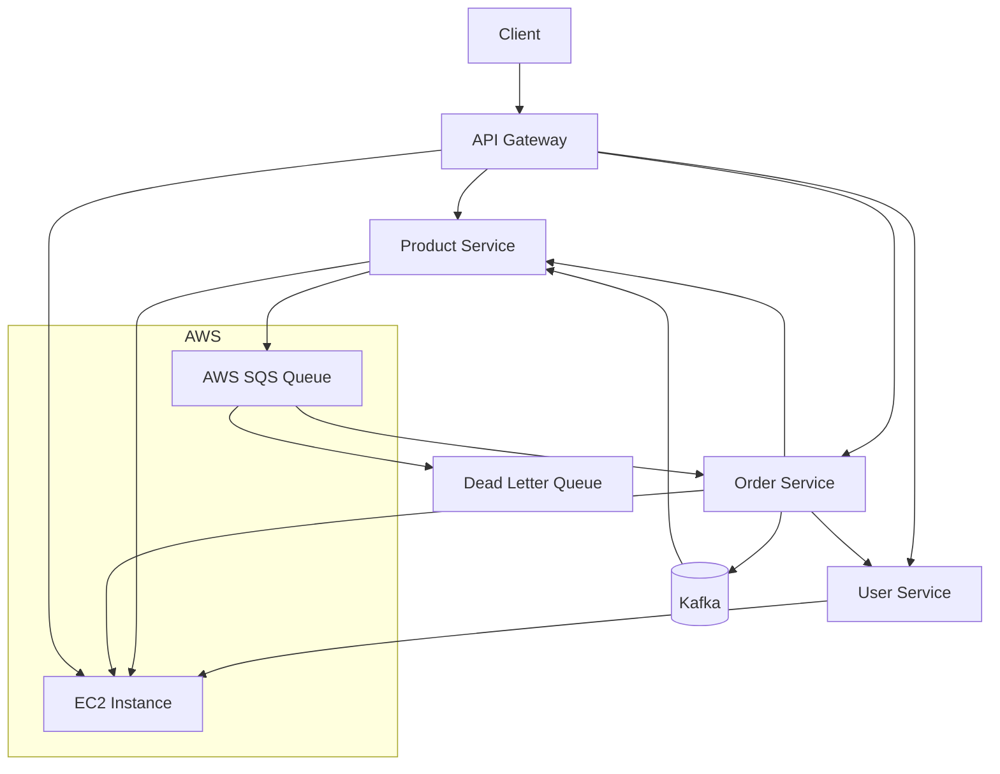

# System Architecture Diagram

## Event Reliability

Amazon SQS is configured with a Dead Letter Queue (DLQ).

Messages that fail processing three times are automatically moved to the DLQ for later inspection and troubleshooting.