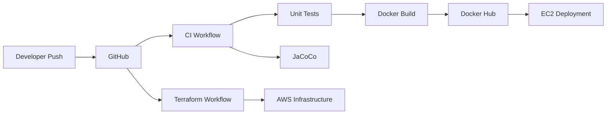

# CI/CD Pipeline

```mermaid
flowchart LR

    Dev[Developer Push]

    Dev --> GitHub[GitHub]

    GitHub --> CI[CI Workflow]

    CI --> Tests[Unit Tests]
    CI --> Coverage[JaCoCo]

    Tests --> Build[Docker Build]

    Build --> DockerHub[Docker Hub]

    DockerHub --> EC2[EC2 Deployment]

    GitHub --> Terraform[Terraform Workflow]

    Terraform --> AWS[AWS Infrastructure]
```