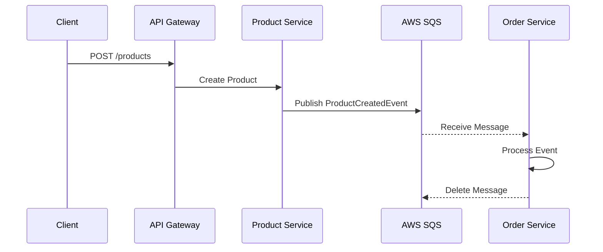

# Product Created Event Flow

```mermaid
sequenceDiagram

    participant Client
    participant API as API Gateway
    participant Product as Product Service
    participant SQS as AWS SQS
    participant Order as Order Service

    Client->>API: POST /products
    API->>Product: Create Product

    Product->>SQS: Publish ProductCreatedEvent

    SQS-->>Order: Receive Message

    Order->>Order: Process Event

    Order-->>SQS: Delete Message
```